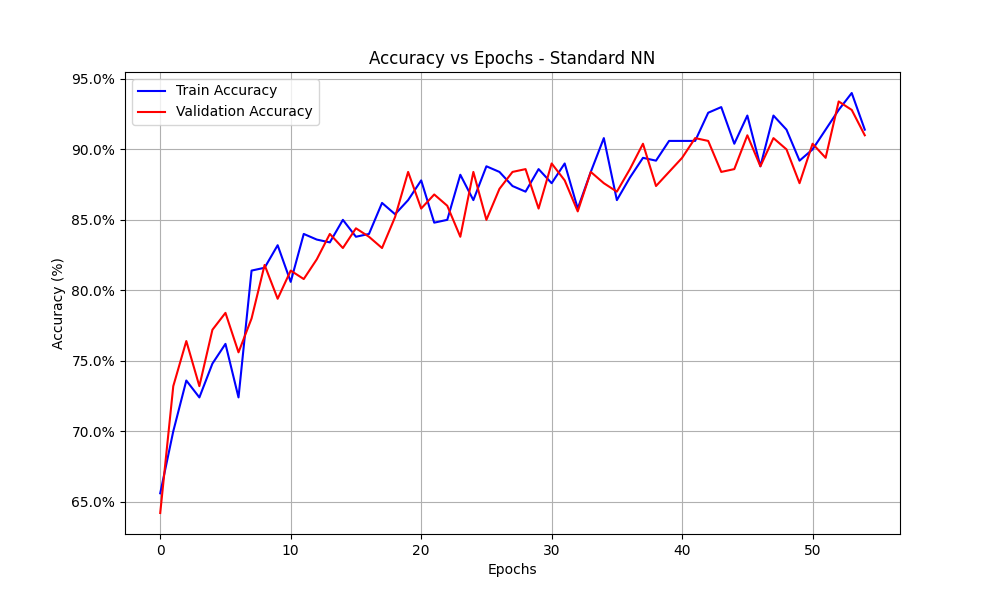
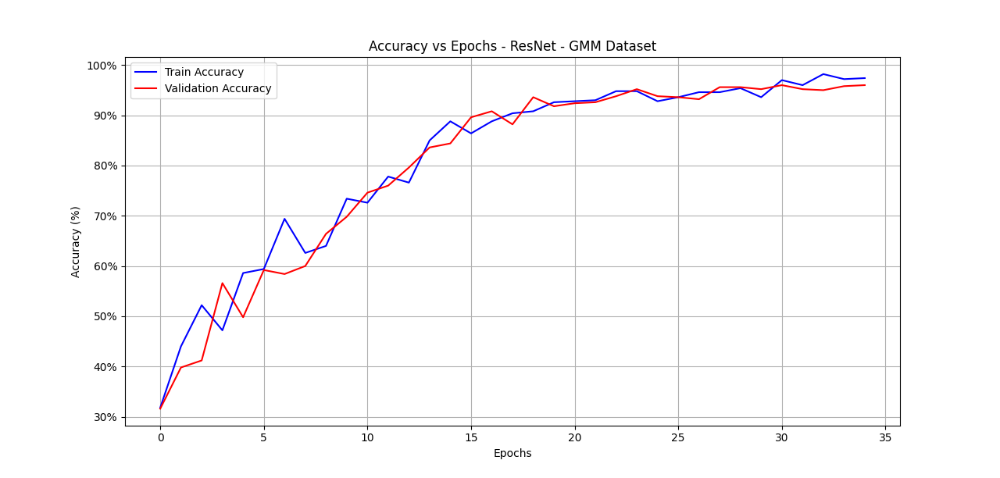

# Deep Learning Neural Networks From Scratch (Python)

## Overview

This project was built to understand how modern neural networks work at a low level by implementing all components from scratch using NumPy.

Instead of relying on deep learning frameworks, the focus is on:
- deriving and implementing forward and backward passes manually
- verifying gradients using numerical methods
- understanding optimization behavior in practice

The project includes both a standard fully connected network and a residual architecture, along with extensive correctness validation.

## Core Components

- Softmax regression output layer
- Cross-entropy loss
- SGD with mini-batch training
- Standard fully connected neural network
- Residual neural network (fully connected ResNet-style blocks)
- Gradient and Jacobian verification (component-level and whole-network)

## Repository Structure

```text
Deep_Learning_NN/
├── src/                     # Core source/model code
│   ├── standard_nn.py
│   ├── resnet.py
│   └── classifier_functions.py
├── tests/                   # Verification scripts
│   ├── gradients/           # Gradient/Jacobian checks
│   └── integration/         # Whole-network gradient checks
├── experiments/             # Training and exploratory scripts
├── data/
│   └── example_datasets/    # .mat datasets used by training scripts
├── reports/
│   ├── Deep Learning Project Report.pdf
│   └── assets/              # Report figures/assets
├── Standard_NN.py           # Root compatibility wrapper
├── ResNet.py                # Root compatibility wrapper
├── requirements.txt
└── README.md
```

## Results

Training on the provided datasets produced the following results:

- **Peaks dataset**: ~92.5% accuracy (standard network)
- **GMM dataset**: ~95% accuracy (standard network)
- **GMM dataset (ResNet)**: up to ~96% accuracy

In addition to accuracy, gradient and Jacobian verification tests demonstrate correct implementation:
- first-order error decreases linearly
- second-order error decreases quadratically

These results confirm correctness of both the forward pass and backpropagation implementation.

### Standard Neural Network (Peaks Dataset)



Training shows stable convergence with close alignment between training and validation accuracy, indicating good generalization.

### ResNet Architecture (GMM Dataset)



The residual architecture achieves faster convergence and higher final accuracy, demonstrating the benefit of skip connections in deeper networks.

Gradient and Jacobian verification scripts show the expected first-order and second-order error trends, supporting correctness of the implemented derivatives.

## Key Engineering Aspects

- Implemented full forward and backward passes manually using NumPy
- Verified gradients using finite-difference methods (Taylor expansion checks)
- Built both standard and residual network architectures
- Explored effects of:
  - learning rate
  - batch size
  - network depth and width
- Structured the project with clear separation between:
  - core logic (`src/`)
  - verification (`tests/`)
  - experiments (`experiments/`)

## How To Run

Install dependencies:

```bash
pip install -r requirements.txt
```

Run training:

```bash
python Standard_NN.py
python ResNet.py
```

Run verification scripts:

```bash
python tests/gradients/grad_test_matrix_weights.py
python tests/gradients/grad_test_matrix_bias.py
python tests/gradients/standard_derivatives_test_v3.py
python tests/gradients/resnet_blocks_test.py
python tests/integration/whole_network_test.py
python tests/integration/resnet_whole_network_test.py
```

## Datasets

Datasets are stored in `data/example_datasets/` as `.mat` files.

## Report

The full write-up is available at:

- [`reports/Deep Learning Project Report.pdf`](reports/Deep%20Learning%20Project%20Report.pdf)

It documents:

- Derivation and implementation details for softmax, cross-entropy, and SGD
- Layer/block-level Jacobian and gradient verification
- Whole-network gradient checks
- Hyperparameter exploration and training outcomes on Peaks and GMM

## License

This project is released under the MIT License.

